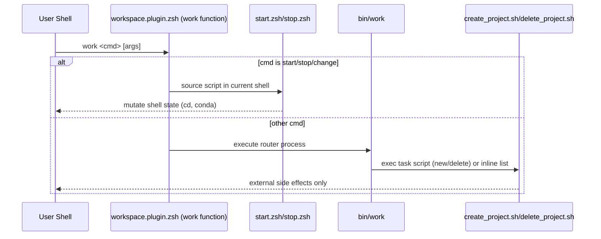

# Architecture

## Purpose
This document explains the runtime control flow of Workspace Manager, with a focus on the sub-shell trap pattern used by the work command.

## Components
- workspace.plugin.zsh: Defines the user-facing work shell function and completion.
- bin/work: Executable CLI router for non-shell-mutating operations.
- bin/start.zsh and bin/stop.zsh: Shell-mutating scripts designed to be sourced.
- bin/create_project.sh and bin/delete_project.sh: Executable task scripts launched by the router.

## Why the Sub-Shell Trap Exists
Some commands must mutate the current interactive shell session. Two key examples are:
- Changing directory with cd.
- Activating/deactivating Conda environments in the current shell.

If these actions run in a child process (sub-shell), their state changes do not persist after the child exits. This is the trap: commands appear to run, but the user shell remains unchanged.

Workspace Manager avoids this by intercepting selected commands in a shell function and running their scripts with source so they execute in the current shell context.

## Control Flow: Interceptor vs Router
The entrypoint seen by users is work. In this project, work is a shell function loaded from workspace.plugin.zsh.

1. Plugin load
- workspace.plugin.zsh is sourced from .zshrc.
- It attempts to source ~/.workspace.conf to populate WS_ variables.

2. Command interception
- The work function captures the first token as cmd.
- It dispatches based on cmd:
  - start -> source bin/start.zsh
  - stop -> source bin/stop.zsh
  - change -> source stop then source start
  - anything else -> call executable bin/work

3. Router execution
- bin/work re-sources ~/.workspace.conf.
- It routes non-intercepted subcommands:
  - new -> exec create_project.sh
  - delete -> exec delete_project.sh
  - list -> inline list output
  - start/stop/change/backup -> placeholder message

The practical model is:
- Shell-state commands are intercepted and sourced by the plugin.
- Process-safe commands are delegated to the executable router.

## Data Flow Walkthrough

### Path A: work start <project>
1. User types work start alpha.
2. Zsh resolves work to the function in workspace.plugin.zsh.
3. Function sets cmd=start and shifts args.
4. Case match start runs:
   - source "$WS_PROJECTS/workspace-manager/bin/start.zsh" "$@"
5. start.zsh runs in the current shell:
   - Selects environment.
   - Activates Conda (if available).
   - cd into project directory.
   - Performs git sync operations.
6. Control returns to prompt with shell state preserved.

Result: active environment and working directory remain changed for the user.

### Path B: work stop
1. User types work stop.
2. Plugin function matches stop.
3. It sources bin/stop.zsh in the current shell.
4. stop.zsh:
   - Iterates project repos.
   - Exports environment.yml.
   - Commits and pushes changes where needed.
   - Deactivates Conda levels.
   - cd to home.
5. Control returns to prompt with teardown state persisted.

Result: shell and repo sync side effects persist in user session.

### Path C: work new my_project
1. User types work new my_project.
2. Plugin function does not intercept new.
3. Default branch executes bin/work new my_project.
4. bin/work loads config and routes to create_project.sh via exec.
5. create_project.sh performs filesystem/git/conda setup in its own process context.

Result: external resources are created, but no reliance on persistent shell mutation.

## Sequence Diagram

## Contributor Notes
- Do not move start/stop/change handling solely into bin/work unless you preserve current-shell execution semantics.
- Any command that must change shell-local state should be sourced from the plugin layer.
- Commands that only mutate external systems (filesystem, git remotes, APIs) can remain process-executed through bin/work.
- The plugin and router both depend on consistent WS_PROJECTS pathing to locate scripts under WS_PROJECTS/workspace-manager/bin.
